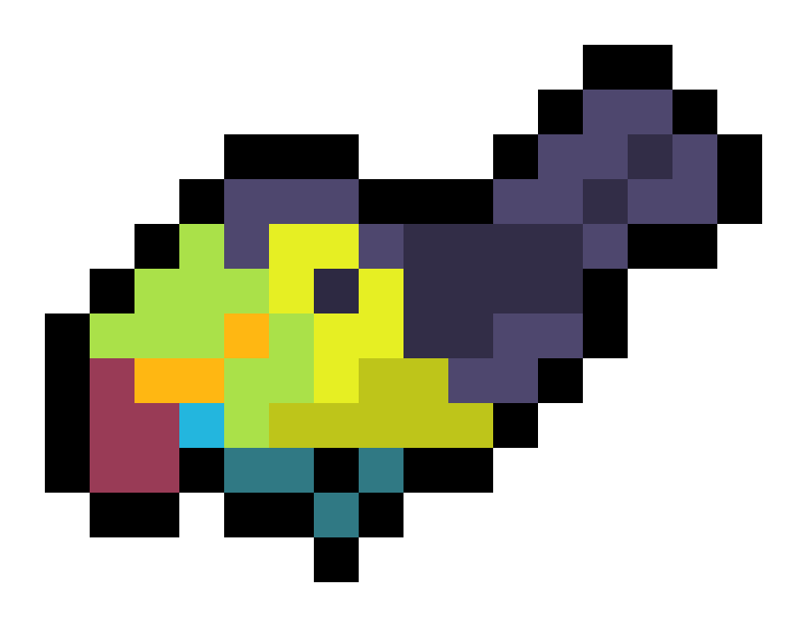

## Hello, I'm Rachel Tsai 

Currently a biochemist dabbling in coding and data science, I'm interested in using programming to manage, analyze and visualize genomic databases. Hosted here are some little trinkets I made for fun.
#### Stack 

---
#### Currently Learning...

---
